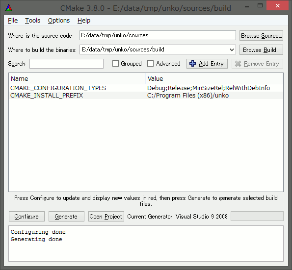

# Unko

A tool for inserting custom objects into an SMW ROM.

## How to use

[It's here](https://boldowa.github.io/unko/).

## How to compile

This program require [cmake](https://cmake.org).

Please install it.

And if you are using the Linux OS, it needs libasar.so.

### Windows

Please let cmake load the CMakeLists.txt

### Linux

1. Move to "build" folder.

2. Run "build.sh".

## Test

type `make unko`.

(However, test will work on Linux only...)

